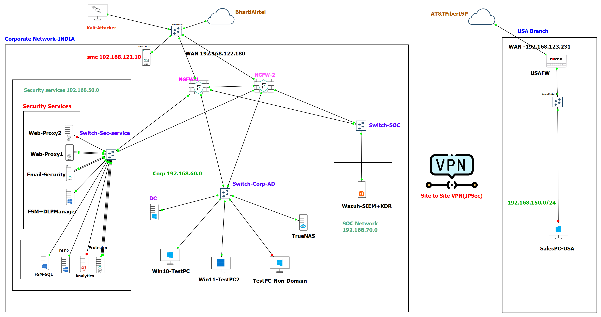

# Enterprise Security Lab — Multi-Site Network with Layered Defense (GNS3).

## Overview

This lab simulates a two-site enterprise network (India HQ and USA branch) built in GNS3, designed to test and validate layered security controls across network, web, email, and data-loss-prevention layers. The goal was to model a realistic corporate environment — complete with a segmented internal network, dedicated security services zone, and a SOC — then actively test the effectiveness of those controls using reconnaissance and attack simulation techniques.

**Why this lab:** Most home labs stop at "I set up a firewall." This one goes further — combining perimeter defense with true **HA clustering**, endpoint infrastructure, threat detection (XDR), and site-to-site connectivity, then validating the setup with real scans, forced-failover tests, and rule testing rather than just assuming it works.

## Topology

**India (Corporate HQ)**

- **Forcepoint NGFW Cluster (Active-Standby HA)** — NGFW-1 and NGFW-2, perimeter firewall / network segmentation, managed centrally via SMC (`192.168.122.10`). WAN edge at `192.168.122.180`. Validated with a real forced-failover test (see [`notes/findings-ngfw-ha-cluster.md`](notes/findings-ngfw-ha-cluster.md)).
- **Security Services Subnet** (`192.168.50.0/24`)
  - Forcepoint Web Security Gateway (Web-Proxy1, Web-Proxy2)
  - Forcepoint Email Security Gateway
  - Forcepoint DLP — FSM + DLP Manager, DLP2, Analytics, Protector, FSM-SQL
- **Corp-LAN Subnet** (`192.168.60.0/24`)
  - Windows Server (AD, DNS, GPO)
  - Windows 10 / Windows 11 client PCs, plus a non-domain test PC (negative-control testing)
  - TrueNAS (shared storage)
- **SOC Subnet** (`192.168.70.0/24`)
  - Wazuh (SIEM + XDR) for centralized logging, alerting, and threat detection
- **Kali-Attacker** — positioned externally (via BhartiAirtel ISP), used for reconnaissance and attack-simulation testing against the WAN edge

**USA (Branch Office)**

- FortiGate firewall (USAFW), WAN `192.168.123.231`, via AT&T Fiber ISP
- Site-to-Site VPN (IPSec) connecting the USA branch to India HQ, tunnel subnet `192.168.150.0/24`
- SalesPC-USA endpoint



## Objectives

- Simulate a realistic enterprise network with segmented zones (security services, corporate LAN, SOC)
- Implement layered security: network firewalling, web filtering, email security, and DLP
- Eliminate the firewall as a single point of failure via an Active-Standby NGFW cluster
- Establish secure site-to-site connectivity between two geographically separated offices
- Centralize visibility and detection using an XDR platform (Wazuh)
- Validate the security posture through active testing rather than assuming configs are correct

## Tools & Technologies

| Category | Tool |
|---|---|
| Network Emulation | GNS3 |
| Firewall / NGFW | Forcepoint NGFW (Active-Standby cluster) |
| Firewall Management | Forcepoint SMC |
| Web Security | Forcepoint Web Security Gateway |
| Email Security | Forcepoint Email Security Gateway |
| DLP | Forcepoint DLP (FSM, DLP Manager, Analytics, Protector) |
| Branch Firewall | FortiGate |
| Connectivity | Site-to-Site VPN (IPSec) |
| Directory Services | Windows Server (AD, DNS, GPO) |
| Endpoints | Windows 10 / Windows 11 |
| Storage | TrueNAS |
| SOC / XDR | Wazuh |
| Testing | Nmap, Kali Linux |

## Testing & Validation

### Firewall Cluster (NGFW HA)

- **Cluster Configuration** — Deployed Active-Standby architecture with CVI (Cluster Virtual IP) and NDI (Node Dedicated IP) per interface. Screenshots show SMC dashboard, interface hierarchy, and live policy rules in [`screenshots/ha-cluster/`](screenshots/ha-cluster/).
- **External Reconnaissance** — Ran Nmap scans from a Kali Linux attacker position (via BhartiAirtel ISP) targeting the cluster WAN edge (192.168.122.180). Results: all ports return `filtered`, no service banners, no information leakage — confirming default-deny policy enforcement.
- **Zone Segmentation Testing** — Blind scans from internal non-domain test PC (192.168.60.100) against Security Services (192.168.50.0/24), SOC (192.168.70.0/24), and other zones returned uniformly `filtered` responses — confirming bidirectional zone isolation and zero topology leakage.
- **Failover Validation** — Forced failure of active node (NGFW-1) during continuous ping to cluster CVI. Measured results: automatic failover to NGFW-2 confirmed, ~3 packets lost / ~3 second outage, manual recovery via "Go Standby" verified correct per Forcepoint design. Full writeup in [`notes/findings-ngfw-ha-cluster.md`](notes/findings-ngfw-ha-cluster.md).

### Firewall Rules & Policy

- **Policy Review** — Live screenshot of INDIAFW-HA firewall policy table showing zone-to-zone rules, VPN rules, heartbeat sync, and outbound policies. See [`configs/HQ/Firewall/firewall-rules-summary.md`](configs/HQ/Firewall/firewall-rules-summary.md) for detailed rule-by-rule breakdown.
- **Site-to-Site VPN** — Verified IPSec tunnel between India HQ (Forcepoint NGFW) and USA branch (FortiGate) remains stable under sustained load. Configuration details in [`configs/USA-Branch/FortinetFW.md`](configs/USA-Branch/FortinetFW.md).

### DLP & SIEM Integration

- **End-to-End Pipeline** — Built Forcepoint DLP → Wazuh integration: configured syslog forwarding from DLP Manager, wrote custom Wazuh decoders/rules to parse CEF-formatted logs, validated with wazuh-logtest, confirmed real incidents generate appropriately-leveled alerts.
- **Dashboard** — Live Wazuh dashboard ("Forcepoint DLP Overview") shows blocked vs. allowed incidents over time, policy categories, severity breakdown, and top source users. Screenshot in [`screenshots/wazuh-siem/`](screenshots/wazuh-siem/).
- **Endpoint Visibility** — Wazuh manages six active agents across infrastructure and endpoints (FMSSRVR, DC1, DLP2, SQL, testpc3, TestPC-USA-01), providing centralized logging and threat detection. Agent status visible in SIEM dashboard.
- **Known Issues & Fixes** — Documented eight non-obvious integration gotchas: TCP/UDP mismatch, reserved field name collisions, decoder chaining limits, field-name collapsing, timestamp mapping failures, rule group inheritance, and aggregation field selection. Full writeup in [`notes/forcepoint-dlp-wazuh-integration.md`](notes/forcepoint-dlp-wazuh-integration.md).

## Repository Structure

```
├── README.md
├── diagrams/
│   └── topology.png
├── configs/
│   ├── HQ/
│   │   ├── Firewall/
│   │   │   └── firewall-rules-summary.md
│   │   └── Wazuh/
│   │       ├── decoders/
│   │       │   └── forcepoint_dlp_decoders.xml
│   │       └── rules/
│   │           └── forcepoint_dlp_rules.xml
│   └── USA-Branch/
│       └── fortigate/
├── screenshots/
│   ├── ha-cluster/
│   │   ├── INDIAFW-HA_cluster_dashboard.png
│   │   ├── INDIAFW-HA_cluster_interface_Config.png
│   │   └── INDIAFW-HA_cluster_Policy_rule.png
│   └── wazuh-siem/
│       ├── forcepoint_DLP_Wazuh_dashboard.png
│       └── WazuhDashboard.PNG
└── notes/
    ├── findings-ngfw-ha-cluster.md
    └── forcepoint-dlp-wazuh-integration.md
```

## Future Improvements

- [ ] Add a Backup Heartbeat interface for the NGFW cluster (currently only Primary exists) for full redundancy of the sync path itself
- [ ] Re-point the site-to-site IPSec VPN to terminate on the cluster CVI rather than a node's physical IP, so the VPN doesn't become the remaining single point of failure
- [ ] Feed cluster failover/health events into Wazuh SIEM so failover events are logged and alertable
- [ ] Document a dual-WAN uplink design, since firewall HA alone doesn't protect against an ISP-side outage
- [x] DLP-to-SIEM pipeline complete (decoders, rules, dashboard) — see `notes/forcepoint-dlp-wazuh-integration.md`
- [ ] Add SIEM correlation rules for lateral movement
- [ ] Test DLP with sample exfiltration attempts (alerting pipeline now in place to make this measurable)
- [ ] SOC investigation / incident response exercise
