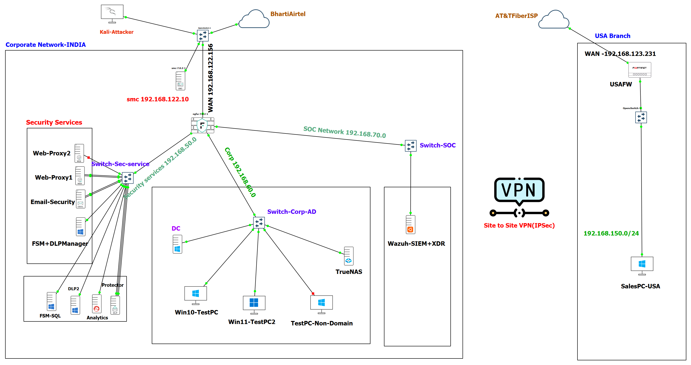
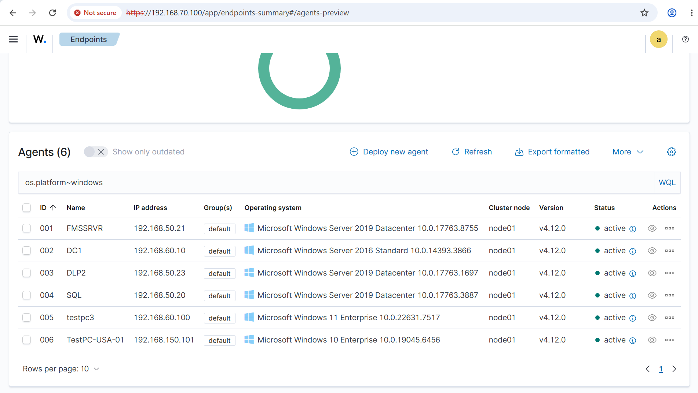

# Enterprise Security Lab — Multi-Site Network with Layered Defense (GNS3)

## Overview
This lab simulates a two-site enterprise network (India HQ and USA branch) built in GNS3, designed to test and validate layered security controls across network, web, email, and data-loss-prevention layers. The goal was to model a realistic corporate environment — complete with a segmented internal network, dedicated security services zone, and a SOC — then actively test the effectiveness of those controls using reconnaissance and attack simulation techniques.

**Why this lab:** Most home labs stop at "I set up a firewall." This one goes further — combining perimeter defense, endpoint infrastructure, threat detection (XDR), and site-to-site connectivity, then validating the setup with real scans and rule testing rather than just assuming it works.

## Topology

**India (Corporate HQ)**
- Forcepoint NGFW — perimeter firewall / network segmentation
- **Security Services Subnet**
  - Forcepoint Web Security Gateway
  - Forcepoint Email Security Gateway
  - Forcepoint DLP
- **Corp-LAN Subnet**
  - Windows Server (AD, DNS, GPO)
  - Windows 10 and Windows 11 client PCs
  - NAS server (shared storage)
- **SOC Subnet**
  - Wazuh (XDR) for centralized logging, alerting, and threat detection

**USA (Branch Office)**
- FortiGate firewall
- Site-to-Site VPN tunnel connecting the USA branch to the India HQ network



## Objectives
- Simulate a realistic enterprise network with segmented zones (security services, corporate LAN, SOC)
- Implement layered security: network firewalling, web filtering, email security, and DLP
- Establish secure site-to-site connectivity between two geographically separated offices
- Centralize visibility and detection using an XDR platform (Wazuh)
- Validate the security posture through active testing rather than assuming configs are correct

## Tools & Technologies
| Category | Tool |
|---|---|
| Network Emulation | GNS3 |
| Firewall / NGFW | Forcepoint NGFW |
| Web Security | Forcepoint Web Security Gateway |
| Email Security | Forcepoint Email Security Gateway |
| DLP | Forcepoint DLP |
| Branch Firewall | FortiGate |
| Connectivity | Site-to-Site VPN |
| Directory Services | Windows Server (AD, DNS, GPO) |
| Endpoints | Windows 10 / Windows 11 |
| Storage | NAS (shared storage) |
| SOC / XDR | Wazuh |
| Testing | Nmap |

## Testing & Validation
- Ran Nmap scans against the Forcepoint NGFW from an external-facing position to assess exposed ports/services
- Reviewed and validated firewall rule behavior (allowed vs. blocked traffic between zones)
- Checked whether segmentation correctly isolated the Security Services, Corp-LAN, and SOC subnets from each other
- Verified site-to-site VPN connectivity and traffic flow between India HQ and the USA branch
- Built a full Forcepoint DLP → Wazuh SIEM pipeline: configured syslog forwarding from Forcepoint DLP, wrote custom Wazuh decoders/rules to parse Forcepoint's CEF-formatted incident/audit/system logs, validated end-to-end with wazuh-logtest, and confirmed real DLP incidents generating correctly-leveled alerts, indexed and visible on a custom Wazuh dashboard. Full writeup, including six non-obvious failure modes and how each was diagnosed, in notes/forcepoint-dlp-wazuh-integration.md
- The screenshot below confirms controlled connectivity between segmented subnets, including the remote USA branch PC communicating with the SOC (Wazuh) over the IPSec VPN tunnel.



## Repository Structure
```
├── README.md
├── diagrams/
│   └── topology.png
├── configs/
│   ├── forcepoint-ngfw/
│   ├── fortigate/
│   └── wazuh/
│       ├── decoders/
│       │   └── forcepoint_dlp_decoders.xml
│       └── rules/
│           └── forcepoint_dlp_rules.xml
├── screenshots/
│   ├── nmap-scans/
│   ├── firewall-rules/
│   └── wazuh-dashboard/
│       └── forcepoint-dlp-overview.png   (add your dashboard screenshot here)
└── notes/
    ├── findings.md
    └── forcepoint-dlp-wazuh-integration.md
```

## Future Improvements
add SIEM correlation rules for lateral movement → DLP-to-SIEM pipeline complete (decoders, rules, dashboard); see notes/forcepoint-dlp-wazuh-integration.md. Lateral-movement-specific correlation rules still open.
test DLP with sample exfiltration attempts (alerting pipeline now in place to make this measurable)
SOC investigation
Incident response
