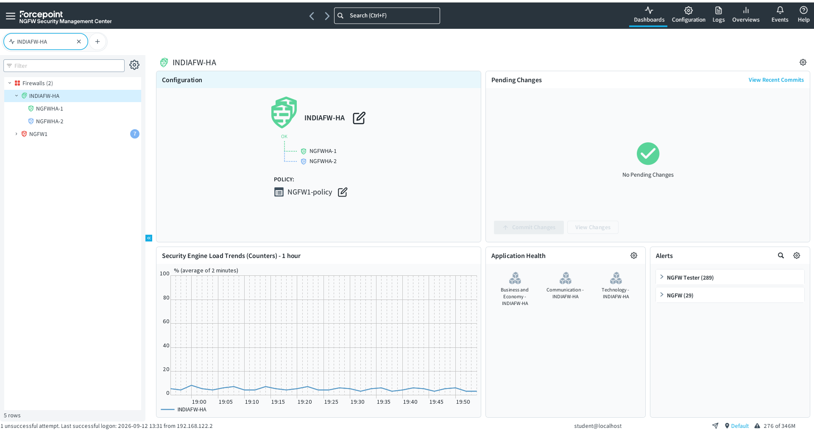
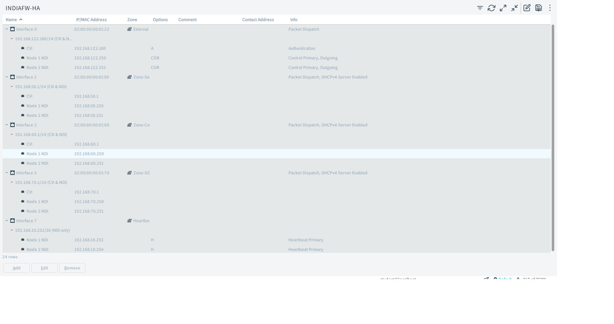
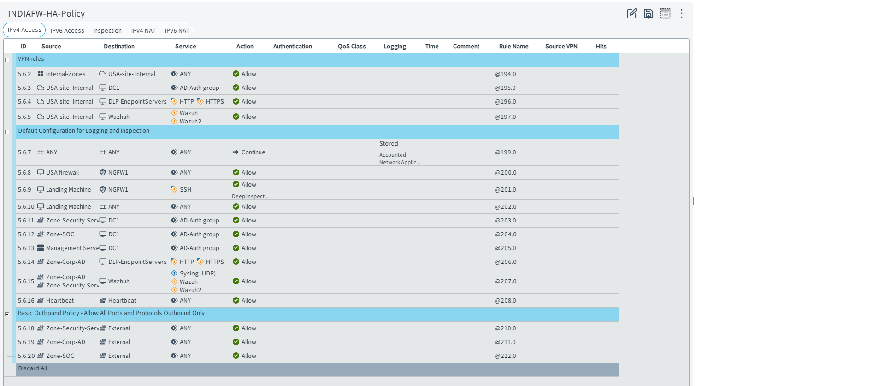

# Forcepoint NGFW Firewall Cluster (HA) — Design, Troubleshooting & Validation

**Lab:** CyberSecLAB (GNS3)

**Component:** INDIAFW-HA (NGFW-1 / NGFW-2) — India HQ perimeter cluster
.

**Objective:** Eliminate the single point of failure at the India HQ internet edge by clustering two Forcepoint NGFW engines in Active-Standby mode, validated with a real forced-failover test rather than a config screenshot alone.

---

## 1. Design

Following Forcepoint's clustering model (inherited from StoneSoft), each shared zone interface — WAN, Security Services, Corp-LAN, SOC — carries:

- **CVI (Cluster Virtual IP)** — one shared IP per interface that both nodes answer to. Switches, gateways, and clients route to this, not to either node's own IP.
- **NDI (Node Dedicated IP)** — each node keeps its own IP on the same interface, used for node-level management/monitoring in SMC.
- **Heartbeat interface** — a dedicated NGFW-1 ↔ NGFW-2 link, carrying only cluster state sync and "is my peer alive" checks. No CVI needed on this interface.

Cluster management is centralized through SMC (`192.168.122.10`), rather than configuring each node independently.

## 2. Issues Found & Root Causes

During initial clustering, NGFW-2 (`NGFWHA-2`) showed intermittent **Offline → Timeout → Online** cycling. Root causes investigated, in order:

1. **GNS3 host resource pressure (ruled out)** — each NGFW node is a fixed-memory VM independent of overall host capacity. Checked `free -h` inside each node directly (not host-level Task Manager) to confirm swap/RAM inside the VM itself wasn't tripping Forcepoint's internal Engine Test thresholds.
2. **Heartbeat link instability (investigated)** — confirmed the link between NGFW-1 and NGFW-2's heartbeat interface (`eth7`) was live and passing traffic; a multicast reachability test on the sync channel was inconclusive on its own and not treated as decisive evidence.
3. **Unicast MAC / switch relearning lag (considered)** — with Unicast MAC mode, CVI MAC ownership has to be relearned by the GNS3 OpenvSwitch nodes each time a node flaps, which can look like instability even when the node process itself is healthy.
4. **SMC logs (decisive check)** —Filtering SMC logs by Sender = NGFW-2 revealed the actual failing condition: interfaces 1, 2, and 3 were not physically connected to any switch. Once connected, their status came up correctly and the false "node down" readings stopped. This was the confirmed root cause.
   
 "Root cause confirmed: item 4 above (unplugged interfaces)"
 
## 3. Recovery Behavior — Documented, Not a Bug

After a node recovers from an outage, it does **not** automatically rejoin as Active or Standby — it sits in a non-participating state until an administrator manually issues **Go Standby**. This is Forcepoint's intended safety behavior: a node that just crashed shouldn't silently rejoin production traffic handling without a human confirming it's healthy.

Applying **Go Standby** manually resolved the recurring flap — the node then stayed persistently in Standby, confirming the underlying instability was genuinely fixed rather than papered over.

## 4. Failover Test — Methodology & Results

**Test:** Forced a failure on the active node (NGFW-1) while running continuous ping through the cluster CVI.

**Result:**
- Automatic failover to NGFW-2 confirmed — no manual intervention required to restore traffic.
- Brief, bounded interruption during cutover (3 packet lost / 3 second).
- Heartbeat, state sync, and all four zone interfaces (WAN, Security Services, Corp-LAN, SOC) confirmed stable post-failover.
- Manual recovery via **Go Standby** confirmed correct per Forcepoint's documented design (Section 3).

**Outcome:** a working, validated Active-Standby Forcepoint NGFW cluster — real automatic failover, a bounded outage window, and a correct recovery procedure for the returning node.

---

## 5. Cluster Configuration — Live Screenshots

### 5.1 SMC Cluster Dashboard
The Forcepoint SMC dashboard below shows the INDIAFW-HA cluster in steady state. Both NGFWHA-1 and NGFWHA-2 nodes are synchronized and healthy; the Security Engine Load Trends graph confirms stable throughput with no anomalies.

### 5.2 Interface Configuration (CVI & NDI)
This screenshot displays the interface hierarchy configured on the cluster. Each zone interface (WAN, Security Services, Corp-LAN, SOC, and Heartbeat) is broken down into:
- **CVI** (Cluster Virtual IP) — the single address all external traffic routes to
- **Node 1 NDI** and **Node 2 NDI** — management IPs for each node
- **Heartbeat interface** — dedicated sync path between NGFW-1 and NGFW-2, using node-only addresses

This design ensures no single node is a bottleneck for state sync or cluster identity.

### 5.3 Firewall Policy Rules
Below is the actual rule policy bound to the INDIAFW-HA cluster. Key observations:
- **Zone-to-Zone Inter-cluster traffic** is allowed with AD-Auth group checks (e.g., row 5.6.3, internal AD authentication group required)
- **Heartbeat rule** (5.6.16) permits the sync channel between nodes
- **Site-to-Site VPN rules** explicitly allow the USA branch tunnel (rows 5.6.2, 5.6.5)
- **Outbound policy** (Basic Outbound Policy) restricts external traffic to known destinations (row 5.6.18 onwards)
- Every rule is logged and includes QoS class assignments for traffic shaping

## 5. Follow-Up / Future Work

- [ ] Add a **Backup Heartbeat** interface (currently only Primary exists) — recommended by Forcepoint KB 000007930 for full redundancy of the heartbeat/sync path itself.
- [ ] Re-point the site-to-site IPSec VPN to India HQ to terminate on the cluster CVI (not a node's physical IP), so the VPN itself doesn't become the remaining single point of failure.
- [ ] Feed cluster failover/health events into Wazuh SIEM so failover events are logged and alertable, not just visible on the SMC dashboard.
- [ ] Document a dual-WAN uplink design as a next step, since firewall HA alone doesn't protect against an ISP-side outage.

---

*Note: true HA timing (sync-link latency, failover speed) in a GNS3 lab won't perfectly mirror physical or cloud-hosted appliances — but the architecture and validation methodology documented here mirror what a real enterprise deployment would use.*
