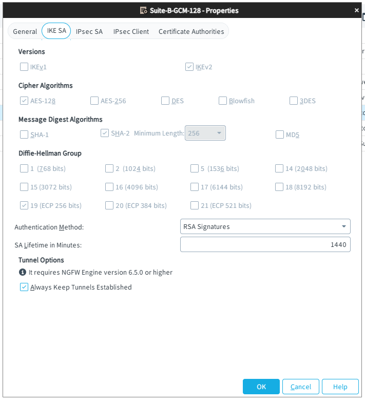
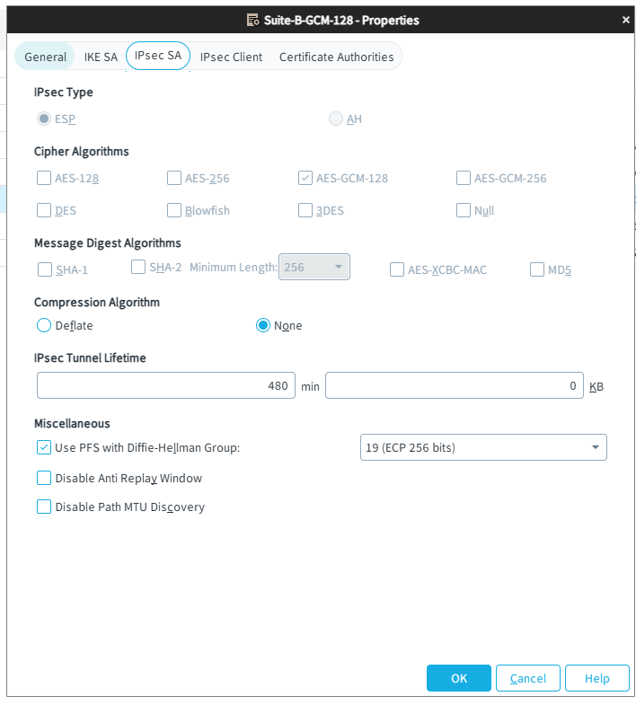
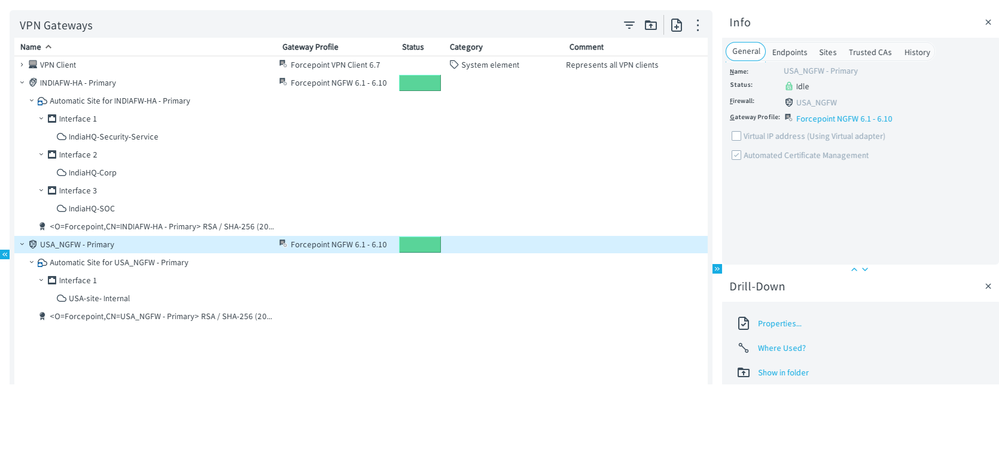
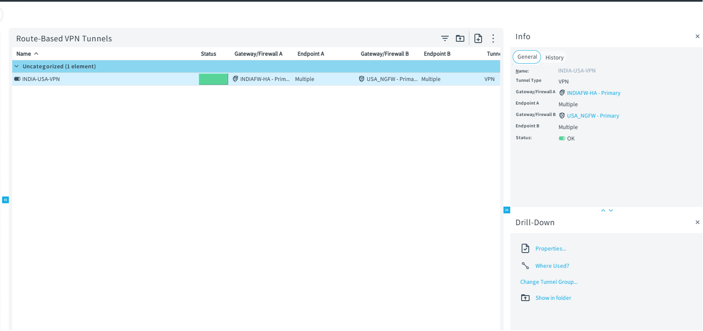
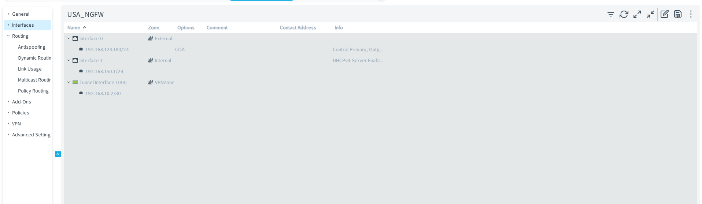
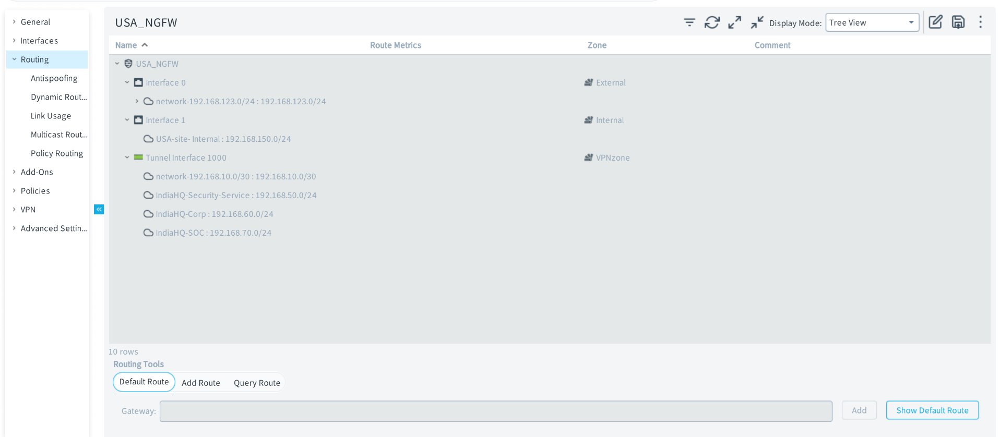
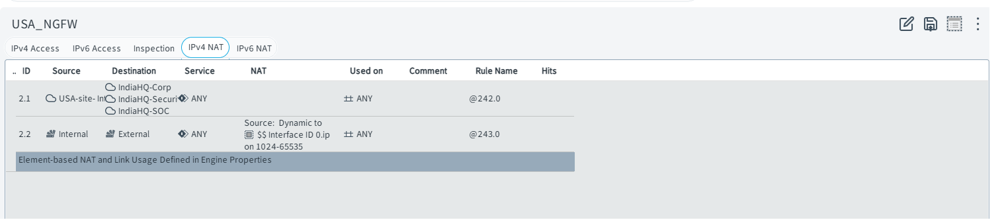

# Findings: USA Branch Migration to Forcepoint NGFW & Site-to-Site VPN Hardening

## Context

The USA branch firewall was originally a FortiGate, connected to the India HQ Forcepoint NGFW HA cluster via a cross-vendor IPsec site-to-site VPN. When the FortiGate evaluation license expired, this was used as an opportunity to re-architect the branch toward a single-vendor design: a standalone Forcepoint NGFW at the USA site, managed by the same SMC instance as the India HA cluster, connected via a native NGFW-to-NGFW route-based VPN.

This document covers the migration, the VPN design decisions, the firewall policy hardening applied on both ends, and what was deliberately left out of scope.

## Topology (current state)

**India HQ** — unchanged: Forcepoint NGFW HA cluster (NGFW-1/NGFW-2, Active-Standby), Security Services subnet (Web Proxy x2, Email Security, DLP stack), Corp-LAN (DC1, Windows clients, TrueNAS), SOC (Wazuh).

**USA Branch** — new: standalone Forcepoint NGFW (`USA_NGFW`)
- WAN: 192.168.123.180/24 (AT&T Fiber ISP)
- LAN: 192.168.150.1/24 (`USA-site-Internal`)
- Single endpoint on the LAN: SalesPC-USA
- Not clustered — a single branch sales endpoint doesn't justify the complexity/cost of HA, unlike HQ where DLP, email security, and multiple subnets are in play

**Management**: one SMC instance manages both the India HA cluster and the USA NGFW — not a separate, siloed SMC per site.

## VPN Design

- **Type**: Route-based VPN (SD-WAN → Policy-Based VPNs / Route-Based VPN Tunnels), not classic policy-based VPN. Each side has a Tunnel Interface (USA: `Tunnel Interface 1000`, 192.168.10.2/30) with the three India subnets (Corp, Security-Service, SOC) reachable via the tunnel in the routing table.
- **Profile**: `Suite-B-GCM-128`
  - IKEv2 only (IKEv1 explicitly disabled — no legacy downgrade path)
  - Cipher: AES-128 (IKE) / AES-GCM-128 (IPsec) — AEAD, no separate MAC needed for IPsec SA
  - DH Group 19 (ECP 256-bit) for both IKE and PFS
  - **PFS enabled** (DH 19) — matches the IKE group
  - **Authentication: RSA Signatures** (switched from an initial PSK configuration) — both gateways have Automated Certificate Management enabled with valid certs, so cert-based mutual auth is actually in use rather than certs being provisioned but unused
  - **Always Keep Tunnels Established**: enabled — the branch link behaves as an always-on connection rather than interest-traffic-triggered
- **NAT**: VPN-destined traffic (USA-site-Internal ↔ India subnets) is explicitly exempted from NAT, and that exemption rule is ordered *before* the general outbound dynamic-PAT rule — the single most common site-to-site VPN misconfiguration (traffic getting NAT'd before it reaches the tunnel) is avoided here.
- **Validation**: both VPN gateways show Status: Online with valid certificates; routes to all three India subnets are present in the USA NGFW's routing table via the tunnel interface; traffic has been confirmed flowing in both directions.

### VPN Configuration Screenshots

**VPN Profile Configuration** — Shows the `Suite-B-GCM-128` profile with all security settings:

The General tab confirms:
- Always-on tunnel (Connection Persistence)
- IKEv2 enabled with negotiation priority settings
- Certificate-based authentication (RSA, not PSK)

IKE Security Association parameters:
- DH Group 19 (ECP 256-bit) for both IKE and PFS
- AES-128 encryption + SHA-256 hash for Phase 1
- Lifetime and rekeying settings

IPsec Security Association parameters:
- AES-GCM-128 (authenticated encryption — AEAD mode, no separate MAC)
- DH Group 19 for Perfect Forward Secrecy
- Tunnel mode (not transport mode)

**VPN Gateway Configuration** — Shows both the India HQ and USA gateways:

Both gateways are shown as **Online** with:
- Valid RSA certificates (not self-signed, auto-managed by Automated Certificate Management)
- Matching Suite-B-GCM-128 profile
- Tunnel interface IPs assigned

**Route-Based VPN Tunnel Interface** — Shows how the tunnel is configured as a network interface rather than embedded in a policy:

The tunnel interface (1000) is assigned:
- Local IP: 192.168.10.2/30
- Remote IP: 192.168.10.1/30 (India HQ)
- Protocol: IPsec
- Bound to the Suite-B-GCM-128 profile
- Route-based forwarding: traffic destined for the remote India subnets is routed *through* this tunnel interface rather than being policy-matched

## Firewall Policy Design — Defense in Depth, Direction-Aware

Rather than a single symmetric ANY/ANY rule shared across both firewalls, each firewall enforces its own half of the relationship independently. Traffic crosses both firewalls on its way between sites, so each one is treated as an independent enforcement point rather than trusting "it came through the VPN tunnel" as sufficient.

### USA NGFW Interface & Routing Configuration

**USA NGFW Interfaces** — Shows the physical and tunnel interfaces:

Configuration:
- **Interface 0 (WAN)**: 192.168.123.180/24 — connects to AT&T Fiber ISP, public-facing
- **Interface 1 (LAN)**: 192.168.150.1/24 — connects to USA-site-Internal, where SalesPC-USA resides
- **Tunnel Interface 1000**: 192.168.10.2/30 — route-based VPN tunnel to India HQ, assigned to Suite-B-GCM-128 profile

**USA NGFW Routing Table** — Shows how traffic is routed to India subnets via the VPN tunnel:

Critical routes:
- 192.168.60.0/24 (HQ Corp-LAN) → via Tunnel Interface 1000
- 192.168.50.0/24 (HQ Security Services) → via Tunnel Interface 1000
- 192.168.70.0/24 (HQ SOC) → via Tunnel Interface 1000
- 0.0.0.0/0 (Default route) → via Interface 0 (WAN), AT&T ISP gateway

This routing design ensures India-destined traffic *must* traverse the tunnel (no accidental direct routes), while local internet breakout uses the WAN interface.

### Branch → HQ (SalesPC-USA initiating)

Enforced on **both** `USA_NGFW` (primary, closest to source) and `INDIAFW-HA` (secondary, protecting HQ assets independently):

| Destination | Services allowed | Rationale |
|---|---|---|
| DC1 | AD-Auth group (DNS, Kerberos, Kerberos Administration, Kerberos IV, LDAP/LDAPS, Global Catalog LDAP/LDAPS, Microsoft-DS, MSRPC Endpoint Mapper, NTP), SMTP | Domain join, authentication, GPO, time sync. SMTP included because HMailServer runs on DC1 itself — not a stray rule, this is the actual mail service location. |
| DLP-EndpointServers | HTTP, HTTPS, Microsoft-DS | DLP endpoint agent communication |
| Wazuh | Wazuh, Wazuh2 (custom service objects) | Reserved for when the Wazuh agent is deployed to SalesPC-USA — not yet active, see Known Limitations |

### HQ → Branch (zero standing access — deliberate)

No rule currently permits HQ-initiated traffic (e.g., RDP/WinRM for remote admin) into USA-site-Internal. This is an intentional design decision, not an oversight: there's no current operational need for HQ to initiate connections into the branch endpoint, so no standing rule exists for it. If remote administration of SalesPC-USA is needed in the future, a narrowly scoped rule (specific admin source, RDP or WinRM only, logged) will be added at that time rather than restoring a blanket allow.

### USA NGFW Policy Rules — Screenshots

**VPN Policy Rules (Branch → HQ)** — Shows the access control list for traffic flowing from SalesPC-USA to India HQ resources:

Each rule is logged and scoped to specific services (DNS, Kerberos, LDAP, HTTP/HTTPS, etc.), not blanket ANY/ANY.

**NAT Policy Rules** — Shows the NAT exemption for VPN traffic, positioned *before* the default dynamic-PAT rule:

Critical detail: The "No NAT for VPN" rule (exempting 192.168.150.0/24 ↔ 192.168.150.0/24 — India subnets) appears *first* in the NAT policy, ensuring VPN traffic never gets source-NAT'd to the USA NGFW's public IP. If this rule were ordered *after* the dynamic-PAT rule, VPN traffic would be NAT'd and the tunnel would fail.

**India HQ VPN Policy** — For comparison, the India-side policy showing how the reverse direction is independently enforced:

The India cluster enforces its own set of allow rules for USA-bound traffic, rather than blindly allowing everything that comes through the tunnel.

### Logging

The top-level "Continue" rule on both firewalls was configured with logging overrides (Log Level: Stored, Connection Closing: Log Accounting Information, Network Applications: Enforced), which cascades to the Allow rules beneath it in that section — rather than configuring logging per individual rule.

## Hardening Changes Made (Before → After)

| Area | Before | After |
|---|---|---|
| PFS | Disabled | Enabled, DH Group 19 |
| VPN authentication | Pre-Shared Key (certs provisioned but unused) | RSA Signatures |
| VPN access rules | ANY/ANY across both directions, all three HQ subnets exposed | Scoped by destination and service on both firewalls; zero standing HQ→branch access |
| Logging | Not configured on VPN/access rules | Enabled via section-level override, cascading to child rules |
| Tunnel persistence | Interest-traffic-triggered | Always Keep Tunnels Established |
| Naming | `USA_NGFW` (engine) vs `USA-NGFW` (policy) inconsistency | *(tracking — cosmetic, low priority)* |

## Known Limitations / Accepted Risk

- **RPC dynamic high-port range not explicitly allowed.** The AD-Auth group includes the MSRPC Endpoint Mapper (TCP), which resolves *where* an RPC service lives, but no corresponding high-port range (or a static RPC port configured on DC1) is present to allow the actual follow-up connection. In testing, all observed functionality (domain auth, DNS, LDAP, GPO, time sync) works correctly without it. This is being left as-is for now rather than opening a wide ephemeral port range or doing the additional work to pin RPC to a static range on DC1 — documented here as a conscious trade-off rather than an unexamined gap. Candidate for future hardening if more complex AD/RPC-dependent functionality is added to the lab.

## Future Roadmap

- **Wazuh integration for both firewalls.** The `Wazuh`/`Wazuh2` service rules already exist in the policy in preparation, but no agent is yet deployed to SalesPC-USA and no firewall log forwarding to Wazuh is active for either site. Planned as the next phase of SOC visibility work, extending the existing DLP-to-Wazuh pipeline to cover firewall-level events from both the India HA cluster and the USA NGFW.

## Lessons Learned

- A single-vendor NGFW-to-NGFW VPN removes an entire class of cross-vendor IPsec interop troubleshooting (cipher suite negotiation mismatches, vendor-specific quirks) that exists with mixed-vendor site-to-site links — at the cost of losing the multi-vendor experience that configuration provided.
- Defense-in-depth is only meaningfully different from a single shared rule set when each firewall is actually configured to independently restrict traffic to what *it* needs to protect, rather than mirroring the same broad rule on both ends.
- Zero standing access in the less-necessary direction (HQ→branch, in this case) is a stronger default than a broad allow rule "just in case" — access can be added on demand, scoped to the specific need, when it's actually required.
- Validating a VPN profile against its own name (e.g., confirming a "Suite-B" profile actually has PFS enabled) surfaced a real gap that wasn't obvious from the tunnel simply being up and passing traffic — "working" and "correctly configured" aren't the same validation.
